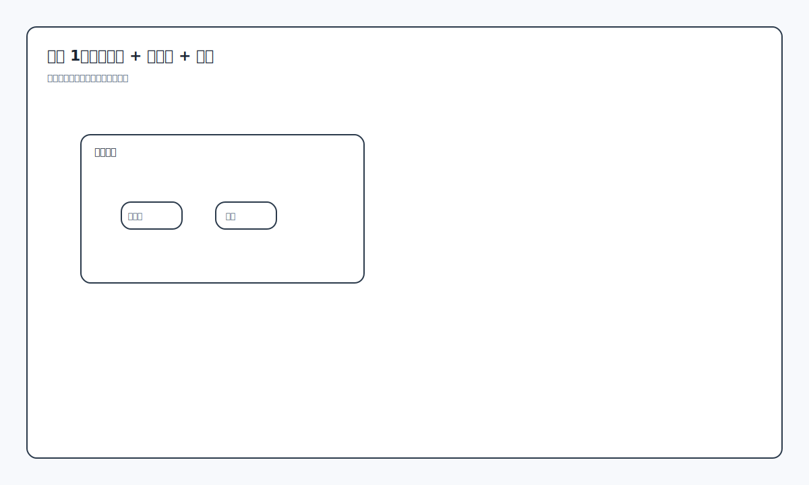
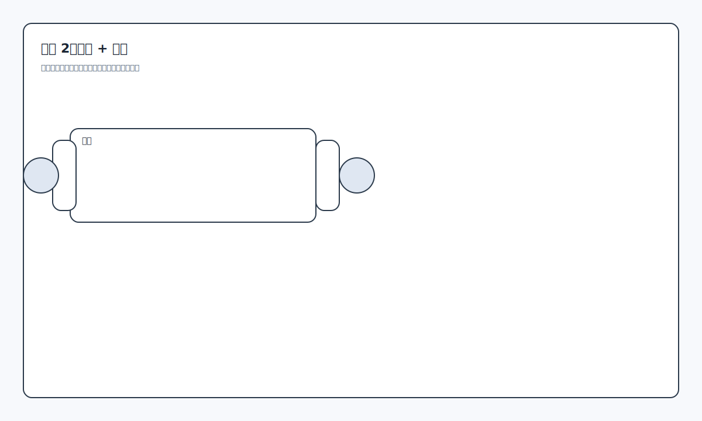
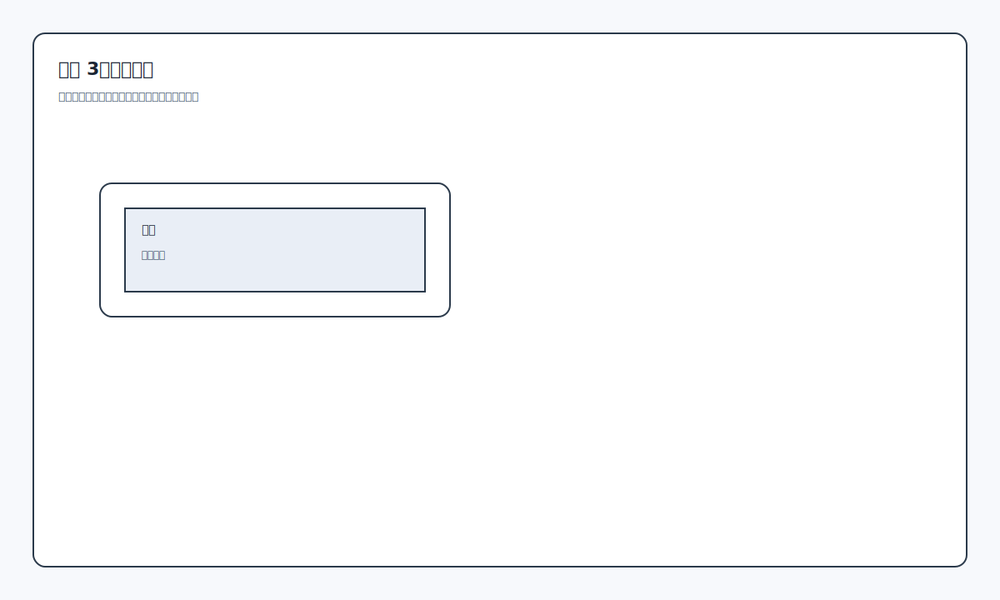
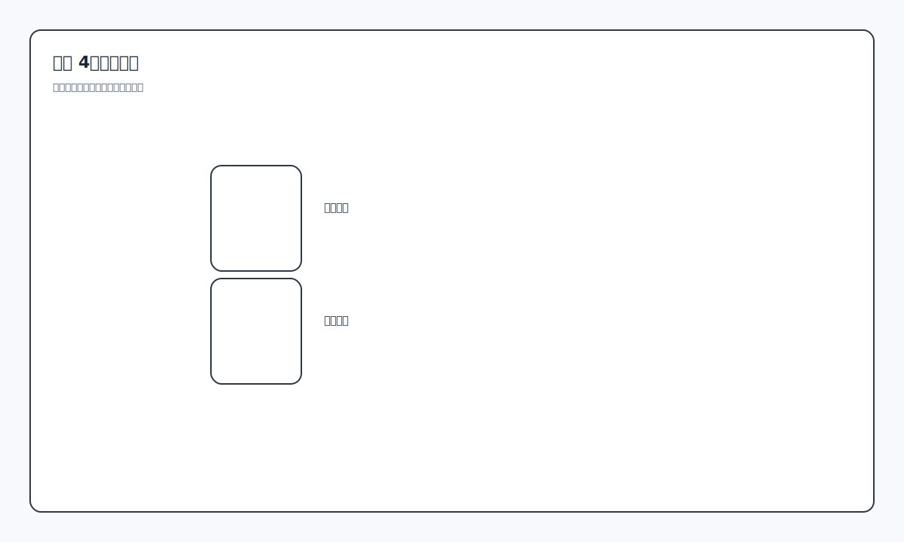
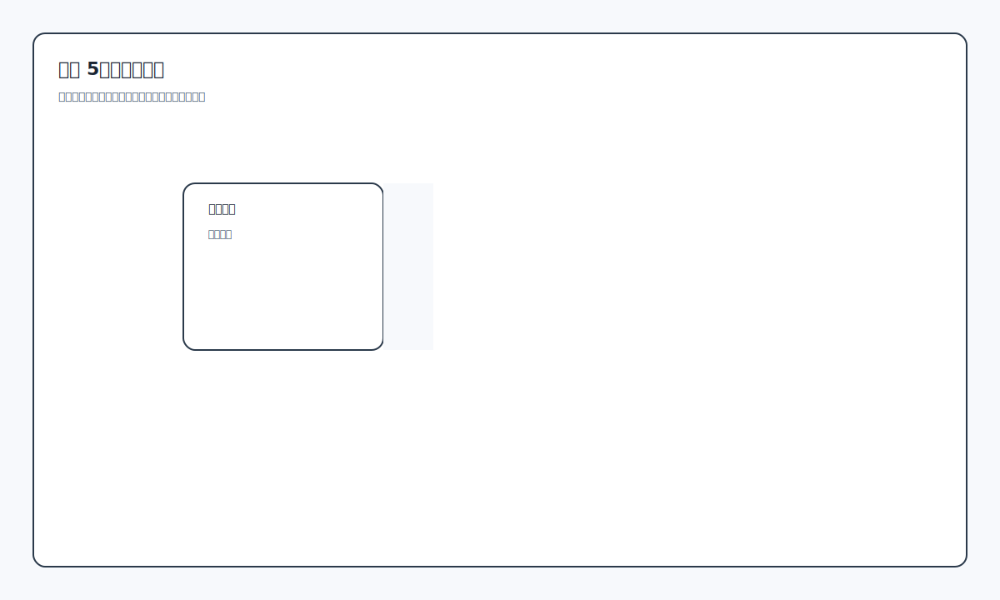
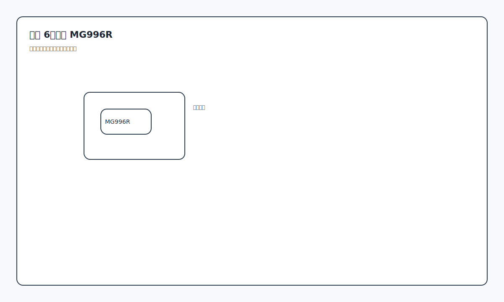
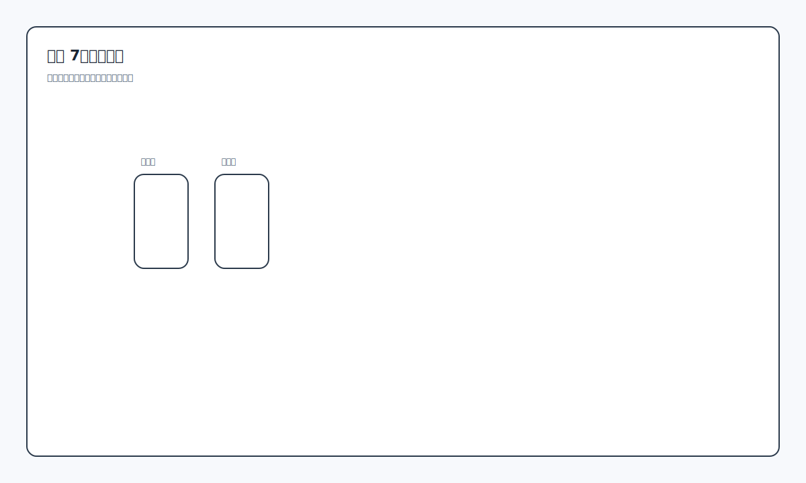
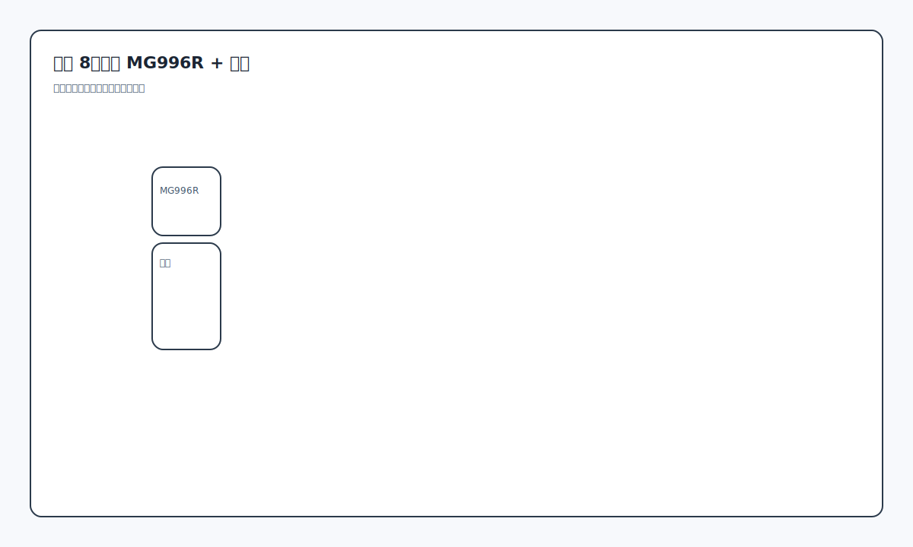
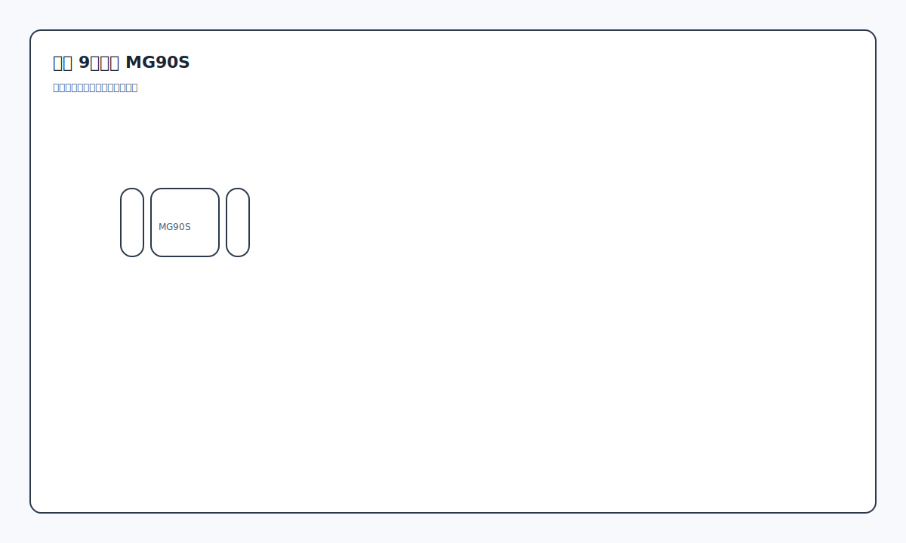
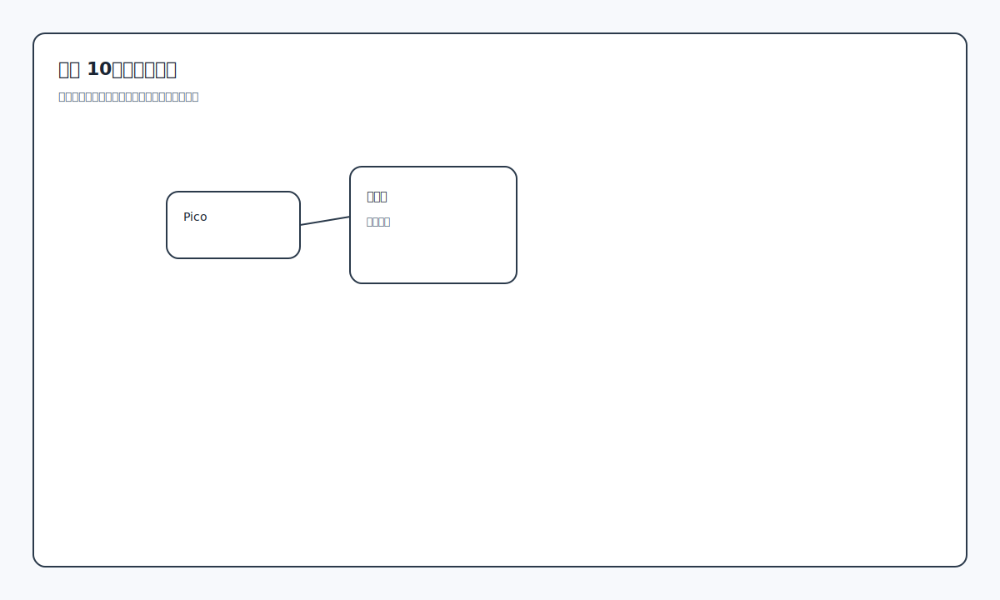

# 手把手装配图解（每步一张图）

## 零经验装配流程（文字版）
1. 核对打印件是否齐全，按类别分好（底盘、立柱、胸腔、手臂、头部）。
2. 先试拼结构件，不装舵机，确认孔位与配合无干涉。
3. 装热熔铜柱（M3），确保后续反复拆装不滑牙。
4. 组装底盘下盖，电源/电池座/开关位置先定位。
5. 轮子与支架先装好，再盖上底盘上盖。
6. 立柱与胸腔先空装，确认高度与结构稳定。
7. 舵机先上电到“中位”再安装（这是虚拟与现实一致的关键）。
8. 先装肩部 MG996R，再装上臂结构。
9. 再装肘部舵机与前臂，检查旋转是否顺畅。
10. 安装夹爪 MG90S，确保不会卡住或磨擦。
11. 理线与固定，避免线束进入关节活动范围。
12. 上电测试：先单个舵机，再整体动作；不一致就校准 `invert` 或 `servo_min/max`。

参考：`docs/robot-firmware.md` 中有校准与控制说明。

## 步骤 1：底盘下盖 + 电源座 + 开关

## 步骤 2：轮子 + 支架

## 步骤 3：底盘上盖

## 步骤 4：立柱拼接

## 步骤 5：胸腔半封闭

## 步骤 6：肩部 MG996R

## 步骤 7：上臂安装

## 步骤 8：肘部 MG996R + 前臂

## 步骤 9：夹爪 MG90S

## 步骤 10：接线与测试

