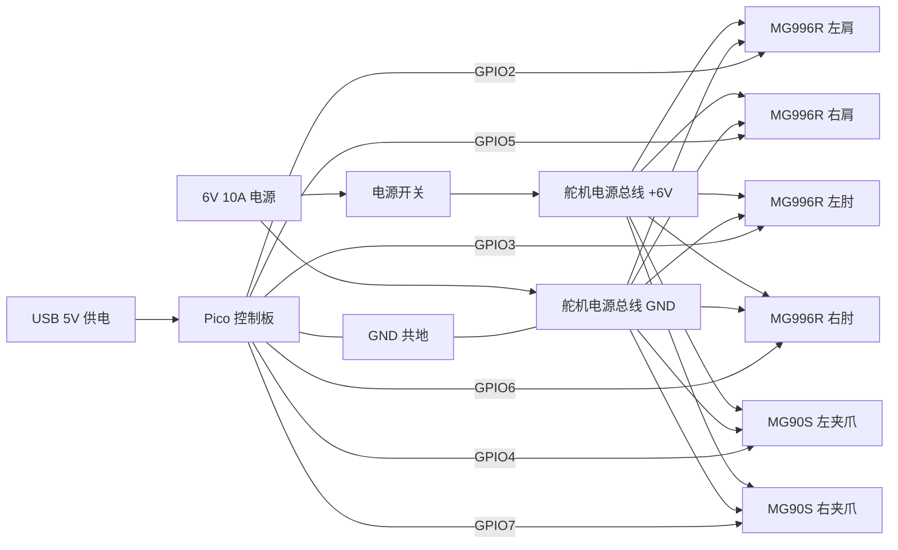

# 电气布线图 + 真实装配图解（一步到位可装）

## 1. 电气布线图（主方案：双电源）

说明：
1. 舵机用 6V 供电，Pico 用 USB 5V 供电。
2. 必须共地：Pico 的 GND 与舵机电源 GND 相连。
3. 不要从 Pico 直接给舵机供电。

### 1.1 底盘驱动（可选，TB6612FNG）
用途：底盘左右转向（双电机差速）。

接线（Pico -> TB6612FNG）：  
- STBY -> GPIO8  
- AIN1 -> GPIO9  
- AIN2 -> GPIO10  
- PWMA -> GPIO11  
- BIN1 -> GPIO12  
- BIN2 -> GPIO13  
- PWMB -> GPIO14  

TB6612FNG 其余接线：  
- VM -> 电机电源（6V 或 2S 电池）  
- VCC -> Pico 3.3V  
- GND -> 共地  
- A01/A02 -> 左电机  
- B01/B02 -> 右电机  

说明：电机电源与舵机电源可分开，但必须共地。

## 2. 线序表（锁定版）
1. 左肩 MG996R -> GPIO2
2. 左肘 MG996R -> GPIO3
3. 左夹爪 MG90S -> GPIO4
4. 右肩 MG996R -> GPIO5
5. 右肘 MG996R -> GPIO6
6. 右夹爪 MG90S -> GPIO7

线色建议：
1. 红线：+6V
2. 黑/棕线：GND
3. 黄/橙线：信号

## 3. 线束整理方案
1. 电源线用“主干 + 分支”方式，主干从底盘中心上行。
2. 肩部左右分叉进入上臂内侧，肘部预留回环。
3. 线束与旋转部位保持 3~5 mm 余量，避免拉扯。
4. 线束穿过孔位时加护线圈或胶管。

## 4. 真实装配图解（一步到位）

### 4.1 底盘与供电
1. 底盘下盖放平，安装 DC 电源座与开关。
2. 开关与电源座串联接好，固定到下盖。
3. 整理电源主干线（+6V 与 GND），预留向上走线孔。
4. 安装左右轮支架，并固定轮子。
5. 扣合底盘上盖前先完成主干线束整理。

### 4.2 立柱与胸腔
1. 安装立柱下段，确认垂直。
2. 立柱上段拼接并锁紧。
3. 安装胸腔左右壳体（暂不完全封闭，便于走线）。

### 4.3 肩部舵机（MG996R）
1. 先给舵机通电并设置到中位（90°），再安装舵盘。
2. 将左右肩部舵机放入胸腔预留空腔。
3. 用 M3 螺丝固定耳位（长孔可微调）。
4. 左右上臂连接到舵盘，确认对称。

### 4.4 肘部舵机（MG996R）
1. 同样先居中舵机。
2. 将肘部舵机放入上臂内部空腔。
3. 固定后连接前臂，保证前臂与上臂同轴。

### 4.5 夹爪舵机（MG90S）
1. 夹爪舵机居中。
2. 放入前臂空腔固定。
3. 连接夹爪两指，测试开合顺畅。

### 4.6 线束与通电
1. 把每个舵机的信号线接到 Pico GPIO。
2. 舵机电源线统一接到舵机电源总线。
3. Pico GND 必须接到舵机电源 GND。
4. 通电测试时先只插 1 个舵机，确认方向后逐个加。
5. 全部测试正常后再封闭胸腔与底盘盖板。

## 5. 快速检查清单
- [ ] 舵机居中后再固定
- [ ] 肩部、肘部轴线对齐
- [ ] 线束有回环余量
- [ ] 舵机电源与 Pico 共地
- [ ] 不从 Pico 给舵机供电
- [ ] 低速测试通过

## 6. 可选单电源方案（需要降压模块）
1. 6V 电源先降到 5V 再给 Pico。
2. 保证电源模块能提供足够电流。
3. 仍然需要共地。
